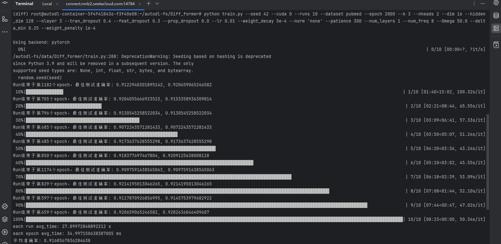

# NoFoDifformer

### NoFoDifformer: A Graph Transformer Integrating Nonharmonic Fourier Filtering and Differential Attention


# Environment Settings
This implementation is based on Python3. To run the code, you need the following dependencies:

- torch==1.8.1+cu111
- torch-geometric==1.7.2
- scipy==1.13.1
- numpy==1.23.0
- tqdm==4.59.0
- seaborn==0.11.2
- scikit-learn==0.24.2
- dgl==0.6.1
- pandas==2.3.1
- googledrivedownloader==1.1.0

Detailed environment configuration is in the [environment.yml](environment.yml) file.

# Usage
All commands and parameters are in the [run.sh](run.sh) 

## Prepare data
Download dataset first, then run the [preprocess_node_data.py](Tools/preprocess_node_data.py) to get (dataset).pt for trainning.

## Run node classification experiment (train model):

    python train.py --seed 42 --cuda 0 --runs 10 --dataset pubmed --epoch 2000 --k 3 --nheads 2 --dim 16 --hidden_dim 128 --nlayer 3 --tran_dropout 0.4 --feat_dropout 0.3 --prop_dropout 0.0 --lr 0.01 --weight_decay 5e-4 --norm 'none' --patience 300 --num_layers 1 --num_freq 8 --Omega 50.0 --delta_min 0.25 --weight_penalty 1e-4

## Result:


## Ablation Study experiment:

You could run the command (if you are interesting in our work, you could also reset some parameters im the [train_AS.py](train_AS.py) to change the rate of two modules for more ablation study experiment)：

    python train_AS.py --seed 42 --cuda 0 --runs 10 --dataset cora --epoch 2000 --k 1 --nheads 1 --dim 32 --hidden_dim 128 --nlayer 1 --tran_dropout 0.7 --feat_dropout 0.5 --prop_dropout 0.6 --lr 0.01 --weight_decay 5e-4 --norm 'none' --patience 300 --num_layers 2 --num_freq 16 --Omega 45.0 --delta_min 0.25 --weight_penalty 1e-4

## Visualization of Filter Responses:

    python train_vis.py --seed 42 --cuda 0 --runs 2 --dataset pubmed --epoch 2000 --k 3 --nheads 2 --dim 16 --hidden_dim 128 --nlayer 3 --tran_dropout 0.4 --feat_dropout 0.3 --prop_dropout 0.0 --lr 0.01 --weight_decay 5e-4 --norm 'none' --patience 300 --num_layers 1 --num_freq 8 --Omega 50.0 --delta_min 0.25 --weight_penalty 1e-4

        
# Baselines links
* [H2GCN](https://github.com/GitEventhandler/H2GCN-PyTorch)
* [HopGNN](https://github.com/JC-202/HopGNN)
* [GPRGNN](https://github.com/jianhao2016/GPRGNN)
* [BernNet](https://github.com/ivam-he/BernNet)
* [JacobiConv](https://github.com/GraphPKU/JacobiConv)
* [HiGCN](https://github.com/Yiminghh/HiGCN)
* [NodeFormer](https://github.com/qitianwu/NodeFormer)
* [SGFormer](https://github.com/qitianwu/SGFormer)
* [NAGphormer](https://github.com/JHL-HUST/NAGphormer)
* [PolyFormer](https://github.com/air029/PolyFormer)
* [Specformer](https://github.com/DSL-Lab/Specformer)
* [GrokFormer](https://github.com/GGA23/GrokFormer/tree/main)
* The implementations of others are taken from the Pytorch Geometric library

# Acknowledgements
The code and filter learning code are implemented based on [GrokFormer: Graph Fourier Kolmogorov-Arnold Transformer](https://github.com/GGA23/GrokFormer/tree/main).


# 📖 Citation

If you find this work useful, please cite our paper:

```bibtex

